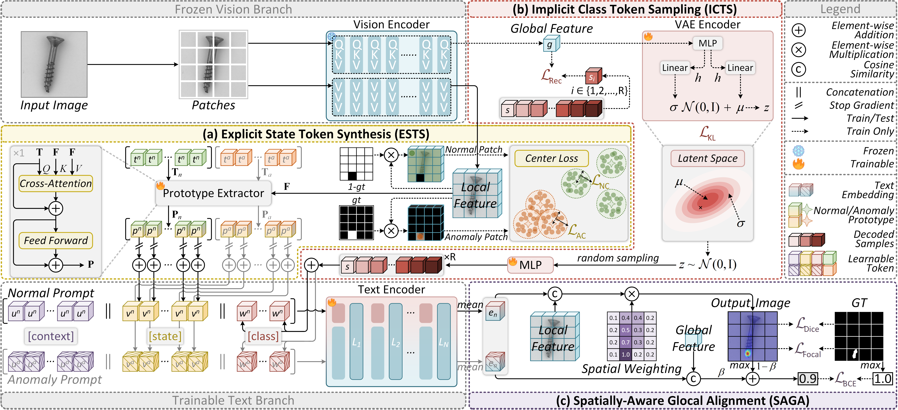

# CoPS

**CoPS: Conditional Prompt Synthesis for Zero-Shot Anomaly Detection**

_Qiyu Chen, Zhen Qu, Wei Luo, Haiming Yao, Yunkang Cao, Yuxin Jiang, Yinan Duan,  
Huiyuan Luo, Chengkan Lv*, Zhengtao Zhang_

[ArXiv Preprint Link](https://arxiv.org/abs/2508.03447)

## Introduction
CoPS dynamically synthesizes visually conditioned prompts to fine‑tune CLIP, achieving SOTA zero‑shot anomaly detection.
The source code for CoPS will be made publicly available upon the paper's acceptance.
Here, we present a brief summary of CoPS's performance across 5 industrial and 8 medical datasets:
<table style="border-collapse: collapse; table-layout: fixed; width:2100px; white-space:nowrap;">
  <tr>
    <td style="width:140px; text-align:left;">Metrics</td>
    <td style="width:140px; text-align:center;">MVTec-AD</td>
    <td style="width:140px; text-align:center;">VisA</td>
    <td style="width:140px; text-align:center;">BTAD</td>
    <td style="width:140px; text-align:center;">MPDD</td>
    <td style="width:140px; text-align:center;">DTD-Synthetic</td>
    <td style="width:140px; text-align:center;">HeadCT</td>
    <td style="width:140px; text-align:center;">BrainMRI</td>
    <td style="width:140px; text-align:center;">Br35H</td>
    <td style="width:140px; text-align:center;">ISIC</td>
    <td style="width:140px; text-align:center;">CVC-ColonDB</td>
    <td style="width:140px; text-align:center;">CVC-ClinicDB</td>
    <td style="width:140px; text-align:center;">Kvasir</td>
    <td style="width:140px; text-align:center;">Endo</td>
  </tr>
  <tr>
    <td style="text-align:left;">I-AUROC (%)</td>
    <td style="text-align:center;">95.0</td>
    <td style="text-align:center;">85.4</td>
    <td style="text-align:center;">93.6</td>
    <td style="text-align:center;">78.6</td>
    <td style="text-align:center;">95.2</td>
    <td style="text-align:center;">96.1</td>
    <td style="text-align:center;">97.4</td>
    <td style="text-align:center;">98.7</td>
    <td style="text-align:center;">–</td>
    <td style="text-align:center;">–</td>
    <td style="text-align:center;">–</td>
    <td style="text-align:center;">–</td>
    <td style="text-align:center;">–</td>
  </tr>
  <tr>
    <td style="text-align:left;">P-AUROC (%)</td>
    <td style="text-align:center;">93.4</td>
    <td style="text-align:center;">95.7</td>
    <td style="text-align:center;">94.6</td>
    <td style="text-align:center;">97.5</td>
    <td style="text-align:center;">98.4</td>
    <td style="text-align:center;">–</td>
    <td style="text-align:center;">–</td>
    <td style="text-align:center;">–</td>
    <td style="text-align:center;">93.8</td>
    <td style="text-align:center;">85.6</td>
    <td style="text-align:center;">88.8</td>
    <td style="text-align:center;">85.8</td>
    <td style="text-align:center;">90.0</td>
  </tr>
</table>
